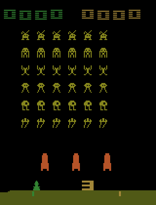
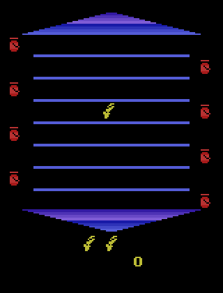
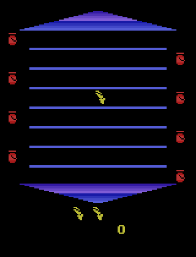

# Deep Q Learning

## Description
The goal of this project is to create an agent (deep convolutional neural network) that will learn to play simple computer games. The DQN must take only images as an input and returns the best action to do on this game state.

## Dependencies
To run this project you need:
* Python3
* Tensorflow
* Numpy
* Gym-retro
* Scikit-image

## The Agent plays Atari2600 games
## SpaceInvaders
### After 30 minutes of training

#### After one hour of training

## Asterix
### After one hour of training

### After 90 minutes of training

